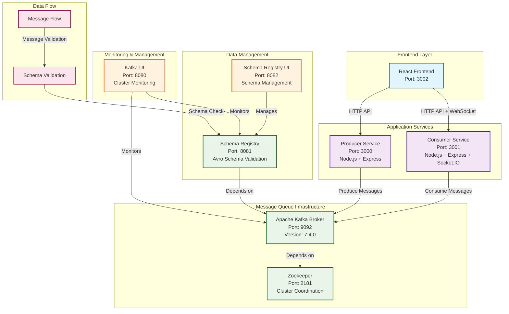
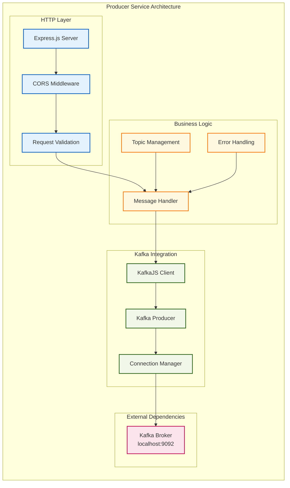
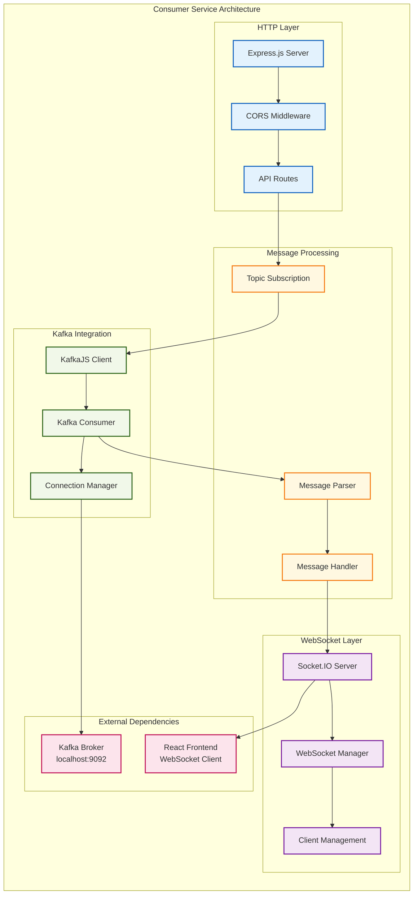
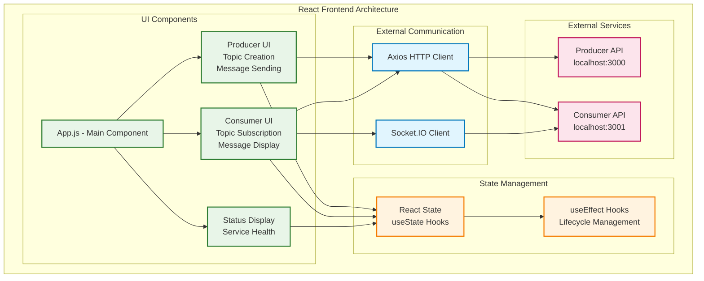
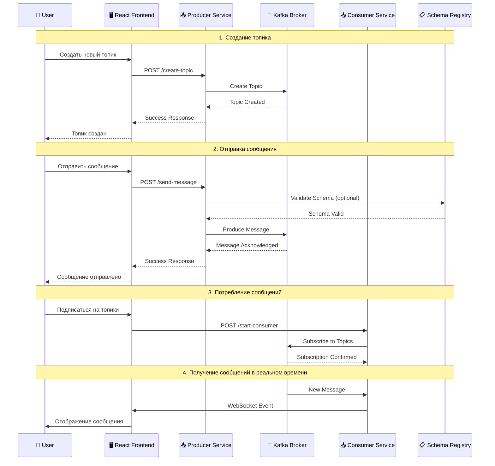
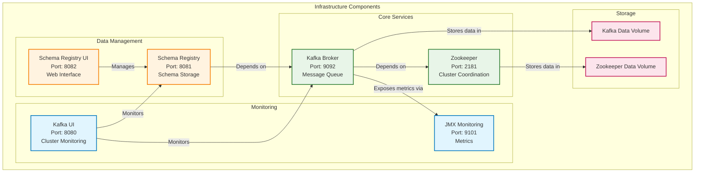
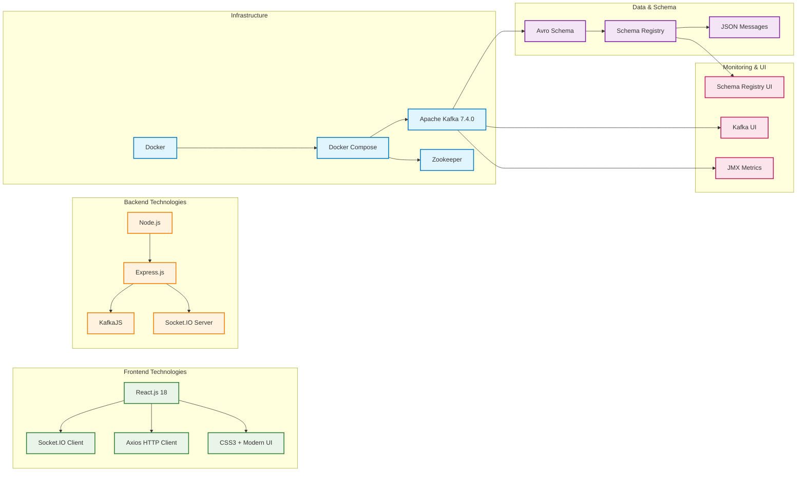
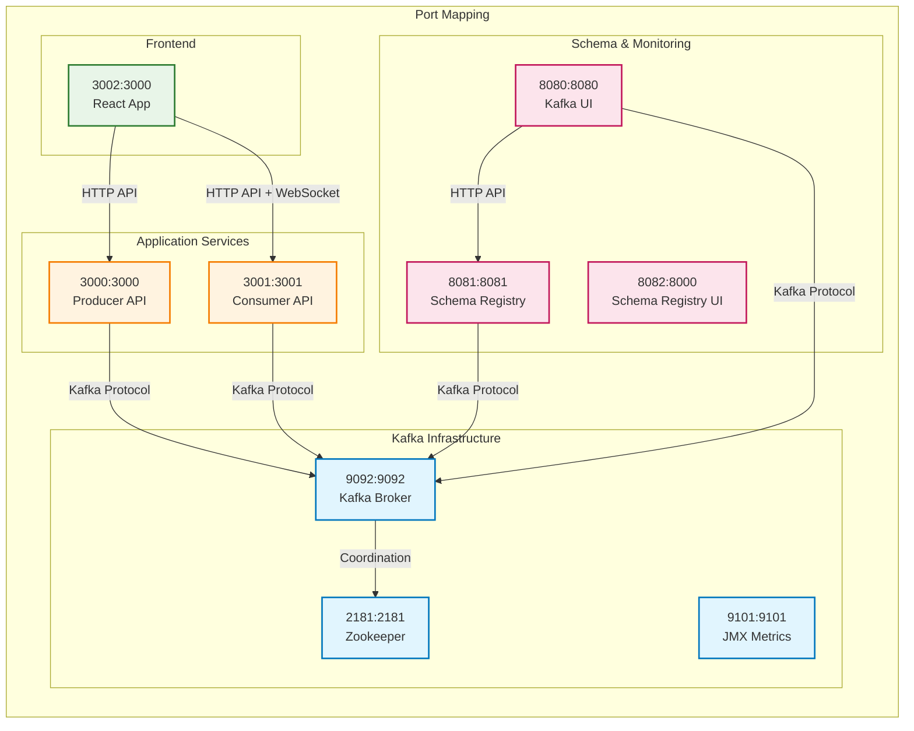

# 🏗️ Архитектура Kafka Demo Application

## Общая архитектура системы

## Детальная архитектура Producer Service

## Детальная архитектура Consumer Service

## Архитектура React Frontend

## Поток данных в системе

## Компоненты инфраструктуры

## Технологический стек

## Порты и сетевые соединения

---

## 📋 Краткое описание архитектуры

### 🏗️ **Общая структура**
Система построена по микросервисной архитектуре с четким разделением ответственности между компонентами.

### 🔄 **Поток данных**
1. **Producer Service** принимает HTTP запросы и отправляет сообщения в Kafka
2. **Kafka Broker** хранит сообщения в топиках с партициями
3. **Consumer Service** подписывается на топики и получает сообщения в реальном времени
4. **React Frontend** предоставляет веб-интерфейс для управления всей системой

### 🛠️ **Ключевые технологии**
- **Backend**: Node.js + Express.js + KafkaJS
- **Frontend**: React.js + Socket.IO + Axios
- **Infrastructure**: Docker + Docker Compose
- **Message Queue**: Apache Kafka 7.4.0
- **Schema Management**: Confluent Schema Registry

### 📊 **Мониторинг и управление**
- **Kafka UI** для мониторинга кластера Kafka
- **Schema Registry UI** для управления схемами данных
- **JMX метрики** для производительности
- **Health check endpoints** для всех сервисов

### 🔒 **Безопасность**
- CORS настройки для веб-интерфейса
- Изоляция сервисов через Docker
- Валидация схем через Schema Registry

Эта архитектура обеспечивает масштабируемость, отказоустойчивость и простоту развертывания для демонстрационных и образовательных целей. 