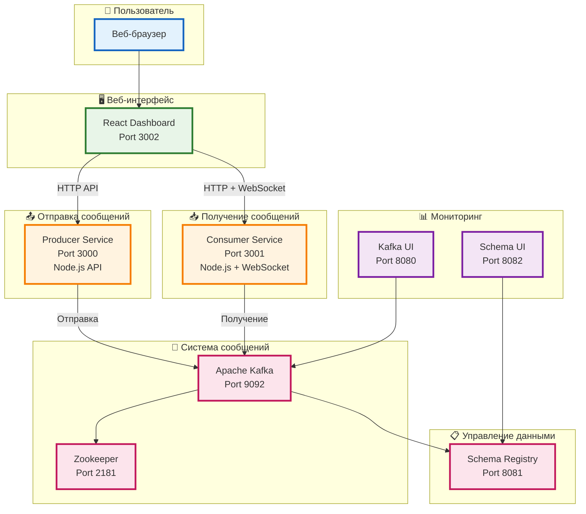

# 🏗️ Упрощенная архитектура Kafka Demo

## Основная схема системы



## Как это работает

### 1️⃣ **Отправка сообщения**
```
Пользователь → React → Producer API → Kafka
```

### 2️⃣ **Получение сообщения**
```
Kafka → Consumer → WebSocket → React → Пользователь
```

### 3️⃣ **Создание топика**
```
React → Producer API → Kafka → Автоматическое создание
```

## Порты системы

| Сервис | Порт | Описание |
|--------|------|----------|
| 🖥️ React Frontend | 3002 | Веб-интерфейс |
| 📤 Producer API | 3000 | API для отправки сообщений |
| 📥 Consumer API | 3001 | API для получения сообщений |
| 📨 Kafka Broker | 9092 | Основной брокер сообщений |
| 🐘 Zookeeper | 2181 | Координация кластера |
| 📋 Schema Registry | 8081 | Валидация схем данных |
| 📊 Kafka UI | 8080 | Мониторинг Kafka |
| 🎨 Schema UI | 8082 | Управление схемами |

## Технологии

- **Frontend**: React.js + Socket.IO + Axios
- **Backend**: Node.js + Express.js + KafkaJS
- **Infrastructure**: Docker + Docker Compose
- **Message Queue**: Apache Kafka 7.4.0
- **Schema**: Avro + Schema Registry

## Преимущества архитектуры

✅ **Микросервисы** - независимые компоненты  
✅ **Real-time** - WebSocket для мгновенных обновлений  
✅ **Масштабируемость** - легко добавлять новые сервисы  
✅ **Мониторинг** - встроенные инструменты наблюдения  
✅ **Простота** - Docker для быстрого развертывания 